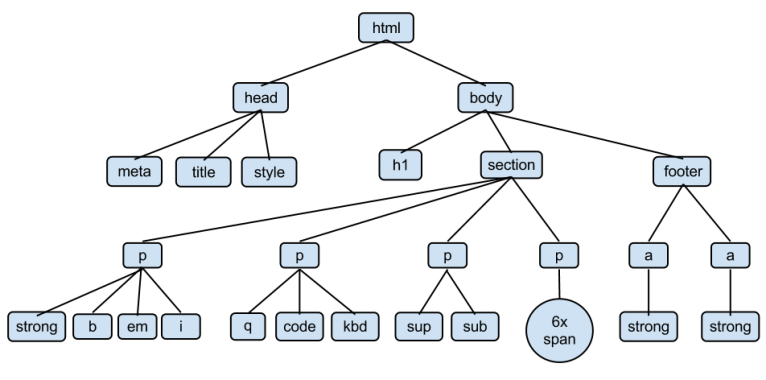

# R-Webscraping

<a href="http://creativecommons.org/licenses/by-nc/4.0/" rel="license"></a>
This tutorial is licensed under a <a href="http://creativecommons.org/licenses/by-nc/4.0/" rel="license">Creative Commons Attribution-NonCommercial 4.0 International License</a>.

# Acknowledgements
This lab is sourced from and adapted from the <a href="https://cougrstats.wordpress.com/2018/10/12/webscraping-in-r/"> CougRStat </a> lesson material,  the <a href="https://remiller1450.github.io/s230s19/Intro_to_Web_Scraping.html"> "Introduction to Data Scraping with R" </a> lab materials developed by Dr. Ryan Miller, as well as Dr. Derek Sonderegger's <a href="https://bookdown.org/dereksonderegger/444/"> "Intro to Data Science using R" </a> curriculum.

# Functions we'll be using
These are the three functions that are used during thie assignment for webscraping. These are the only functions that are used from the “rvest” package. Everything else in this presentation is base R.

```R
read_html()
html_nodes()
html_table()
```

# What is Web Scraping?
Web scraping is the process of automatically collecting data from web pages without visiting them using a browser. This can be useful for collecting information from a multitude of sites very quickly. Also, because the scraper searches for the location of the information within the webpage it is possible to scrape pages that change daily to get the updated information.

# Scraping in R using rvest
We will focus on scraping without any manipulation of the webpages that we visit. Webpage manipulation while scraping is possible, but it can not be done exclusively in R which is why we will be ignoring it for this lesson.

# HTML
HTML stands for HyperText Markup Language. All HTML pages are built using the same format. A very generalized version of this is that a page should always have a header, a body, and a footnote. This isn’t always the case though and is up to the developer.

# HTML Tree


# Q1
Finish the question from 2/23/22 lab if you haven't yet and make sure you save your dataframe! We'll be revisiting it in a later question.

The original question: Import the data from IIHS'Fatal Crash Totals data table (https://www.iihs.org/topics/fatality-statistics/detail/state-by-state) and create a dataframe with at least 2 columns: 1) state; 2) number of deaths per 100,000 individuals

# Information to Gather
Let’s collect some environmental data. I want to know what the weather station on the roof is reporting right now.
The url for the PACCAR Weather Station is http://micromet.paccar.wsu.edu/roof/

# Install rvest
This is a package for R that should download the webpage as html for further manipulation.
```R
# Load the library
if(!require(rvest)){
    install.packages("rvest")
    library(rvest)
}
```

# Download the HTML
First we need to tell R to navigate to the site and save the current html of the page.
```R
# Save the url as a variable
weather.station <- read_html('http://micromet.paccar.wsu.edu/roof/')
```

# Extract Values From Table
Next we specify the html nodes that we are interested in. In this case these are all referred to with the label “font” which allows us to specify that we want all values from the page that are labeled “font”.
```R
# Extract the table values from the HTML
table.values <- html_nodes(weather.station, xpath = '//font/text()')
```

# Visualize the table
```R
head(table.values, 13)
```

```{r}
## {xml_nodeset (13)}
##  [1]  
##  [2]  Latest time
##  [3]   2022-02-05 07:18:00 
##  [4] Net Radiation
##  [5]   -49.06  Wm
##  [6] Temperature
##  [7]    2.6  &amp;deg C ( 36.7 &amp;deg F )
##  [8] Humidity
##  [9]    79.7 %
## [10] Pressure
## [11]    932.4 mbar
## [12]  Wind speed
## [13]    5.8 m/s (13 mph)
```

# Indexed List
What is an index list? An index list is a list of the items in a list based on their position.
For example, in the list ```, Latest time, 2022-02-05 07:18:00, Net Radiation, ... ``` Latest time is in the second ([2]) index position, 2022-02-05 07:18:00 is [3], and so on. NOTE: In the R/RStudio scripting language, index position counting starts at one (1). This is different than other programming languages like Python where counting starts at zero (0).

# Save the Values as Individual Variables
We’re going to save the values that we want from the previous list as individual variables
```R
# Time
scraped.datetime <- as.character(table.values[3])
# Radiation
radiation <- as.character(table.values[5])
# Temperature
temperature <- as.character(table.values[7])
# Humidity
humidity <- as.character(table.values[9])
# Pressure
pressure <- as.character(table.values[11])
# Wind Speed
wind.speed <- as.character(table.values[13])
# Rain
rain <- as.character(table.values[17])
```

# View the Variables to Check Formatting
Let’s view one of our variables to see how it is formatted now.
```R
# Print the variable to the console
scraped.datetime
```

```{r}
## [1] "  2022-02-05 07:18:00 "
```

# Split the Datetime into Date and Time
```R
# Use strsplit to separate into a list
datetime <- strsplit(scraped.datetime, " ")
# View the list after the split
datetime
```

```{r}
## [[1]]
## [1] ""           ""           "2022-02-05" "07:18:00"
```

```R
# Select and save the scraped date
scraped.date <- datetime[[1]][3]
# Select and save the scraped time
scraped.time <- datetime[[1]][4]
# Print the time
scraped.time
```


```{r}
## [1] "09:10:00"
```

# Create a Function to Scrape Radiation
This is our radiation scraping function. (Note: Want to learn more about creating functions? Check out: https://swcarpentry.github.io/r-novice-inflammation/02-func-R/)

```R
scrape.raditation <- function(){
  # Download the html
  weather.station <- read_html('http://micromet.paccar.wsu.edu/roof/')
  # Extract the table values
  table.values <- html_nodes(weather.station, xpath = '//font/text()')
  # Save the radiation value
  radiation <- as.character(table.values[5])
  # Split the string
  radiation.temp <- strsplit(radiation, " ")
  # Return only the numerical value
  return(radiation.temp[[1]][3])
}
```

# Let’s Try Our Radiation Function
Execute the function

```R
scrape.raditation()
```

# More Tabular Data
Navigate to the https://en.wikipedia.org/wiki/List_of_countries_by_population_in_1900 URL in a web browser.

## Q2
How does the "tabular" data here different from the WSU source? 

# More Tabular Data (cont.)

We'll now read web page into R using the ```read_html``` function from the rvest package. ```read_html``` uses HTML's markup language structure and tags to parse the web page into an R object.

```R
popParse <- read_html("https://en.wikipedia.org/wiki/List_of_countries_by_population_in_1900")
str(popParse)
```
```read_html``` creates an R object with information about the web page, based on the HTML tags present in the web page. We now have a ```popParse``` object that includes nodes, or HTML elements from the web page.

We can now work on transforming our ```popParse``` object into a table. This will involve multiple steps. First step is to see what tables are in the ```popParse``` object.
```R
popNodes <- html_nodes(popParse, "table")
popNodes
```

# More Tabular Data (cont.)

We can select one of those tables and extract it as a new object. We'll do this by selecting the fourth table using double brackets, which are used to index list object.
```R
# creates a new object pop with the content of the sixth table from popNodes
pop <- html_table(popNodes, header = TRUE, fill = TRUE)[[6]] 
str(pop)
```

# Cleaning the dataframe
Now we can start to focus on cleaning the pop data frame. Notice that even though the first and third columns are numbers, they are classified as “character.” For Rank, that is because the first observation is the world population and it is not assigned a rank, but rather, the character “-”. We can remove the world population row.

```R
# creates new pop2 object with first row removed from pop object
pop2 <- pop[-1, ]
head(pop2)
```

We will need to reset the row numbers.
```R
# reset row numbers
row.names(pop2) <- NULL
```

We're still stuck with Rank and Population columns that are not numbers. We need to convert these columns to be numeric.
```R
# force rank field to be a number
# this output WILL include an error message--don't panic!
pop2$Rank <- as.numeric(pop2$Rank)
```

The Population column is also a character because the numbers have commas in them, plus some observations include characters such as [1] to indicate some footnotes. We can use the ```parse_number``` function to remove commas and footnotes from the Population column.

If not installed and/or loaded yet, we'll need both ```rvest``` and ```stringr``` packages for ```parse_number()``` and ```str_replace_all()``` functions.

install.packages("rvest")
library(rvest)

```R
# remove commas and footnotes from population column
pop2$Population <- parse_number(pop2$Population)
```

We can also rename the third column to Population.
```R
names(pop2)[3] <- "Population"
```

Almost there! We can use regular expressions to remove footnotes from the ```Country/Territory``` field.
```R
pop2$`Country/Territory` <- str_replace_all(pop2$`Country/Territory`, "\\[[^]]+\\]", "")
head(pop2)
```

Take a look at ```pop2```. Now we have a data frame that could be used for different kinds of analysis and visualization.

# Q3
Make sure pop2 object is visible in your .HTML file after knitting.

## Q4-Q7
Q4: Take a data table from a web page of your choosing and convert to an R data frame. Include comments that document steps you're taking in that process. Part of this process will most likely involve data cleaning procedures: you're welcome to use R and/or OpenRefine for this step (Note: If you use OpenRefine, please also submit a .txt file with the <a href="https://datacarpentry.org/openrefine-socialsci/05-scripts/index.html">JSON script</a>). For those still getting a feel for rvest, you're free to explore a Wikipedia table. I encourage more advanced users of R, however, to consider other sites. Don't forget about the <a href="https://selectorgadget.com/"> SelectorGadget tool</a>.

Q5: Document and describe your strategies for Q5. What were some issues you rain across and how did you problem solve?

Q6: Describe what kinds of visualization or analysis you could do with the data you scrapped in Q5. 

Q7: From the same <a href="https://www.iihs.org/topics/fatality-statistics/detail/state-by-state">IIHS website</a> in Q1, import data related to seat belt usage. Join the dataframe you created in Q1 with seat belt use and make a scatter plot of percent seat belt use vs. number of fatalities per 100,000 persons. (Note: Consider joining by State)
